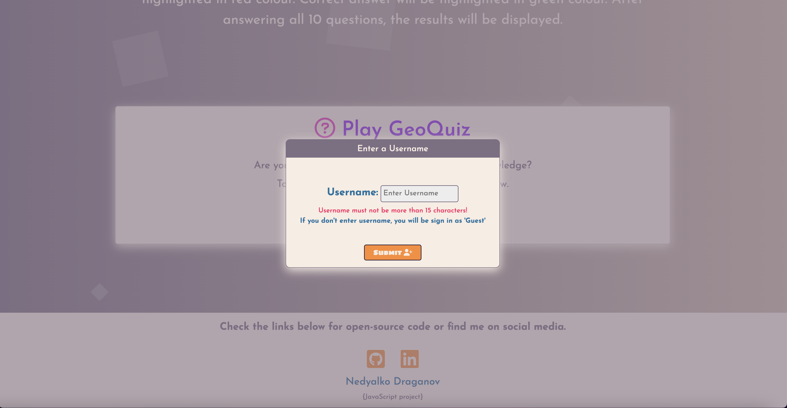

# GeoQuiz
#### JavaScript Project

## Purpose

   This website presents Quiz App and was created to complete my second project for Learning People's Front End Developer course. 
   The purpose of this project is to show my ability to create a website using JavaScript. The full list of technology used can be found down below in Technology section. 

   Users are able to play the Quiz with 10 geography oriented questions. 

   Here is the link to live site: [Live site](https://ndraganov.github.io/JavaScript-QuizApp/ "Live site")

## Deployment

 This project was deployed using Git and GitHub.

 * Git - Hyper Terminal
  
   - git init project directory
   - git add README.md
   - git commit -m "Created README.MD file."

* GitHub - GitHub Desktop

   - GitHub website used for deploy into a live site
     - Settings
     - Pages
     - Build and deploymet section, from Source - Deploy from a Branch
     - From Branch - Selected main and /(root)
     - Save
   - GitHub Desktop used for regularly commit and push to the repository

## Technology

  Technology used:

  * HTML
    - Structure of the website
  * CSS 
    - Styled the website
  * Bootsrap 
    - Framework for style
  * JavaScript 
    - For display and functionality of the Quiz and interactions
  * Google Chrome Developer Tools
     - Used to inspect page elements and debugging peroblems with the layout of the project and 
       JavaScript interactions and functionality
  * Google Fonts
     - Used to import Josefin San font in the project
     - Used to import Sigmar One font for buttons
  * Font Awesome
     - Used for implemetation of icons(header, title of sections, footer's social links, mute Button)
  * Google search, Stack Overflow, W3 Schools
     - Used as primary source for help, regarding resolving issues with code
  * Visual Studio Code 
     - Used as code editor for the project

## Features

  * Navigation Bar
     - I used my own Nav Bar for this project(no Bootstrap)
     
  * About section
     - Short explanation about the GeoQuiz
  * How to play section
     - Short instruction guide for GeoQuiz
     
  * Play section
     - Small section with included START button to play GeoQuiz
     
  * Modal window
     - Small Modal window with included input for enter Username and SUBMIT button
     
  * Quiz Game window
     - On very top text "Welcome [Username]"
     - Below intro with Progress bar for questions tracker, Time tracker, Score tracker
     - Below current Question
     - Below Mute button to pause sounds
     - Below four Options for current Question
     
  * Sound effects
     - With the start of the Quiz, start quiz like sound played
     - On hover question's options, click like sound played
     - For correct and incorrect answers, correct and  incorrect buzz sound played
  * Results window
     - On very top Certificate image
     - Below Address to the User with message acording to the Results
     - Below Info for Attemts, Correct and Incorrect answers, Scores and Time
     - Below included RESTART button
     
  * Footer section
     - Social media links to my GitHub and LinkedIn profiles

## Testing

### Validator testing

  * HTML Validator -  https://validator.w3.org/#validate_by_input
  
  * CSS Validator - http://jigsaw.w3.org/css-validator/
  
  * JavaScript Validator - https://javascriptvalidator.ne
  
     - At first Validator throw me 51 warnings(most of it about ES6). Solution for it: 
     comment at the top of quiz.js(//jshint esversion: 6)
     
     - Then I deleted or added missing parts to resolve the rest 11 warnings
     
     - Then I set variables with the rest of mine quiz.js variables at the top and deleted unused variable
     

### Live site Testing

  * Desktop testing for layout and functionality - iMac 24"
  * Mobile testing for layout and functionality - iPhone 13

## Bugs

Throughout the whole prosses of creating this project I have many, some small, some big bugs.
Here are some of the biggest.

  * Bootstrap Nav Bar(offcanvas) - does not closing when nav links pressed
    - I tried many solutions(examples: class with display: none, use attributes of Bootstrap close button) with no success
    - Created my own offcanvas - for some reason links does not function. And then I found the reason(animation area position top set to 0).  
      Then I set top to 150px
    - So I created my own Nav Bar without any toggle icon(same for Desktop and mobile)
  * Submit button in Modal window not work properly
    - At first I created a Modal window with HTML tag "dialog" because of the predefine CSS properties. The Submit button suppose to send data from 
      username input to "Welcome [Username]" in Quiz game window with the help of JS code but without success. 
      I found the reason(for dialog tag the button's JS override my JS code)
    - Then I used div tag for the Modal window container. Then I set it to take whole page window with background colour with opacity to 
      create Modal styled window and prevent clicking on other elements in the background
  * Loading data from questions.json to quiz.js
    - I created questions.json file containing data for my questions in Content folder
    - I tried different methods to accomplish loading data to quiz.js(fetch, new XMLHttpRequest, import) with no success. 
      Then i moved JSON file into index.html directory. Some of this methods does not produced errors within Console, 
      but lead directly to Results when page loaded
    - So my final solution(I created variable "questions" with JSON syntax code as a JS string, then i used JSON.parse() method)
  * Mute button to work for sound effects
    - At first I tried if statement with condition "muteButton === true". Does not worked
    - Then I used several functions with nested answers.forEach() and pause() methods, currentTime = 0 to pause sound effects.
    - I changed my condition for if statement to "muteButton === false", which solved the problem
    - I have not found solution for multi clickable button(when pressed again to restore play for sounds) yet
  * Address the user Text not display correctly
    - I created Text to address the user in Results window, according to their results. For this purpose I used if, else if statement with 
      conditions according to the win scores(example: score > 50 && score < 90). Does not displayed text properly for every condition
    - Solution was to add "=" sign(score >= 50 && score <= 90). Then every condition worked properly

## Credits

  * I wanna say "thank you" to the team behind MDB and youtube channel [Keep coding](https://www.youtube.com/c/Mdbootstrap "Keep coding") 
    for the main code for my Quz project! Their quiz, reflects pretty much my idea, how I want my quiz to look like
  * Many thanks to my mentor Alex Ford for the guidance, advices and recommended good practices in coding
  * Many thanks to my friend Nasko Daskalov for the support and advices I received from him